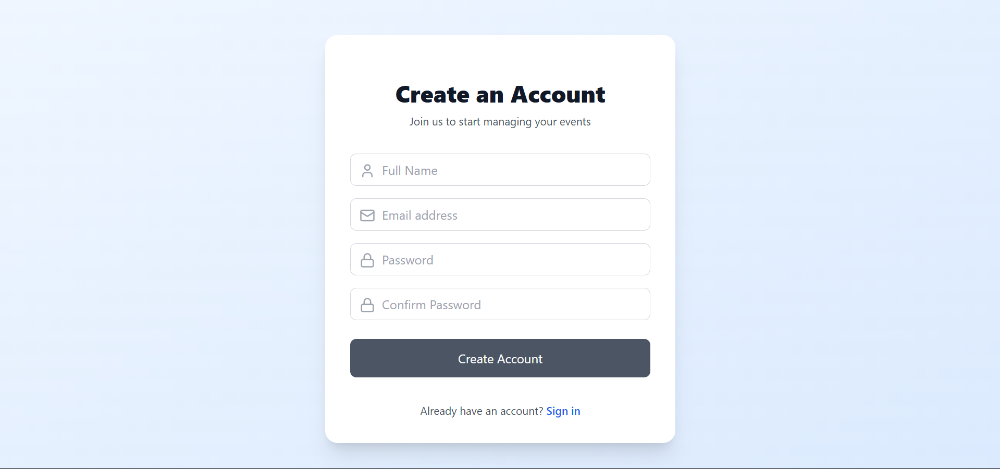

<h1 align="center">EliteEvents</h1>

Event Management Website : Socket.io Implementation for Real-Time Updates
<h3> Live Demo : https://elite-events-cyan.vercel.app/ <h3/>


## Table of Contents

- [Overview](#overview)
- [Backend](#backend)
  - [Endpoints](#endpoints)
  - [Socket.IO Implementation](#socketio-implementation)
- [Frontend](#frontend)
- [Installation](#installation)
- [Usage](#usage)
- [Pics](#Screenshots)

## Overview

Eventify is a comprehensive event management platform that allows users to create, manage, and attend events with real-time updates using Socket.IO. The platform includes user authentication, event creation, and a dynamic user interface for seamless interaction.

## Backend

The backend is built with Node.js, Express, and MongoDB. It handles user authentication, event management, and real-time updates using Socket.IO.

### Endpoints

#### Auth Routes

- **POST** `/api/auth/register`
  - Register a new user.
- **POST** `/api/auth/login`
  - Login a user.
- **POST** `/api/auth/signout`
  - Logout the user.
- **PUT** `/api/auth/update`
  - Update user profile.
- **PUT** `/api/auth/password`
  - Update user password.
- **GET** `/api/auth/profile`
  - gedt user info.

#### Event Routes

- **GET** `/api/events/`
  - Get all events.
- **POST** `/api/events/addevent`
  - Create a new event.
- **PUT** `/api/events/:id`
  - Update a specific event by ID.
- **DELETE** `/api/events/:id`
  - Delete a specific event by ID.  
- **GET** `/api/events/:id/join`
  - Join event with having ID-->id.


### Socket.IO Implementation

The backend uses Socket.IO for real-time updates. The following events are handled:

- **attendeeJoined**: Triggered when a participant joins an event room.
- **attendeeLeft**: Triggered when a participant leaves an event room.
- **newEvent**: Used to create a new event.
- **updateEvent**: Used to update event details.
- **deleteEvent**: Used to delete an event.
## Frontend

The frontend is built with React and utilizes various contexts for managing authentication, events, and socket connections.

## Installation

1. Clone the repository:
   ```bash
   git clone https://github.com/ParasY1724/Eventify.git
   ```
2. Navigate to the backend and install dependencies:
   ```bash
   cd backend
   npm install
   ```
3. Navigate to the frontend and install dependencies:
   ```bash
   cd ../frontend
   npm install
   ```

## Usage

1. Start the backend server:
   ```bash
   cd backend
   npm start
   ```
2. Start the frontend development server:
   ```bash
   cd ../frontend
   npm start
   ```

---

## Screenshots

### Homepage


### Notification Page


### Calendar Page


### Profile Page


### Login Page


### Register Page


### Event Form

